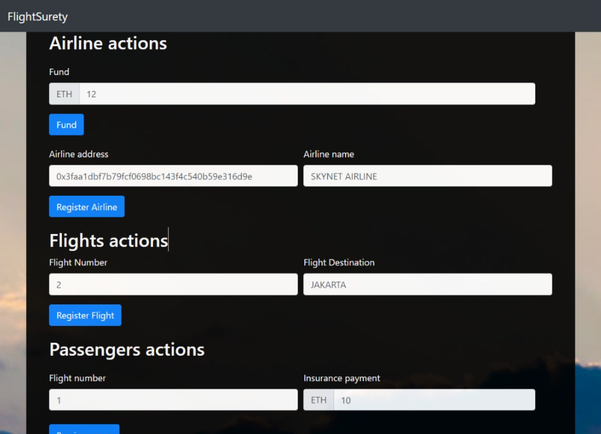

# Blockchain FlightSurety

FlightSurety-MDP is a flight insurance application that currently accepts manually entered addresses and flights. Sample data is provided below to simplify the entry process. The smart contracts provide a framework for expanding the DApp into a more usable application, as it is currently a minimum viable product. The application is easily expandable to create a more robust user experience.

Additional instructions are included to help Windows users get up and running due to the challenges of developing this application on the Windows platform. If you are not using Windows, you can use the standard commands and package.json files that were originally provided for the project.

## Stack
- Truflle Version is 4.1.14
- Web3 v1.2.1
- ✨Node v16.13.2

## Some Lib

Library:

- truffle-assertions - Used this to originally get the events to fire, don't think it is needed because I found a code snipped to raise the events.
- truffle/hdwallet-provider - HD Wallet-enabled Web3 provider. Use it to sign transactions for addresses derived from a 12 or 24 word mnemonic.

### Prerequisites

Please make sure you've already installed ganache-cli, Truffle and enabled MetaMask extension in your browser.

### Installing

A step by step series of examples that tell you have to get a development env running

Clone this repository:

```
git clone https://github.com/IanLaFlair/SimpleFlightSurityBlockchain
```

install all requisite npm packages (as listed in ```package.json```):
dont forget to delete the package.json.lock 
```
npm install
```

Launch Truffle:

```
truffle develop
```

To do truffle test:

```
truffle test ./test/flightSurety.js 
truffle test ./test/oracles.js
```

In a separate terminal window, Compile smart contracts:

```
truffle migrate --reset
```
To start the server
```
npm server
```

To use the dapp:
```
npm run dapp
```

## Deploy

To build dapp for prod:
`npm run dapp:prod`

Deploy the contents of the ./dapp folder
